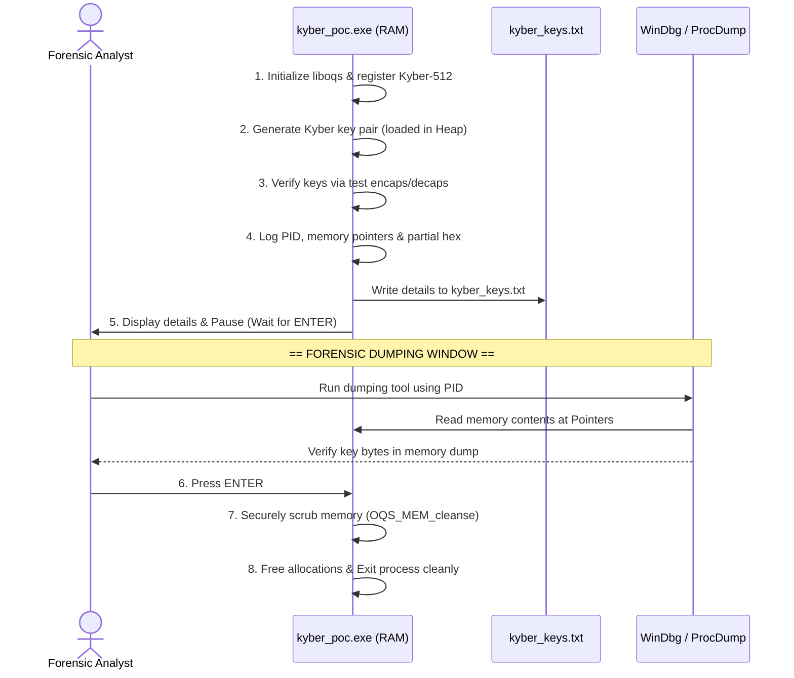

# Kyber-512 Key Generation & Memory Forensic Utility

This repository contains a complete, self-contained C project for Windows that utilizes the official **liboqs** library to generate a post-quantum Kyber-512 keypair, hold the keys in heap memory, and print their addresses and partial contents. This facilitates **memory forensic analysis** (RAM extraction and process memory inspection).

---

## 📊 Process & Forensic Workflow

Below is the execution flow, showing how the keys are loaded, verified, dumped via forensic tools, and then securely wiped from RAM:



---

## 📁 Repository Structure

- **`main.c`**: Core source code containing logic, memory logging, and interactive suspension.
- **`include/oqs/`**: Official header files for `liboqs` C API.
- **`oqs.lib`**: MSVC import library.
- **`oqs.dll`**: Dynamic link library required to run the compiled executable.
- **`kyber_poc.exe`**: Pre-built executable ready to run immediately.
- **`CMakeLists.txt`**: Build configuration file for building from scratch.
- **`.gitignore`**: Excludes temporary build files, `.obj` objects, and local keys output files.

---

## 🛠️ Direct Compilation (Windows Command Line)

If you modify the source code, you can easily re-compile the executable using Visual Studio's command-line toolchain:

1. Open PowerShell or Command Prompt.
2. Build the project using MSVC:
   ```cmd
   cmd.exe /c "call \"C:\Program Files\Microsoft Visual Studio\18\Community\VC\Auxiliary\Build\vcvars64.bat\" && cl.exe main.c /I\"include\" /Fe:kyber_poc.exe /link oqs.lib ws2_32.lib"
   ```

---

## 🔍 Step-by-Step Forensic Analysis Guide

### Step 1: Run the Executable
Start the program inside PowerShell or Command Prompt:
```powershell
.\kyber_poc.exe
```
The console will report the full setup process, Process ID (PID), heap memory pointers, and partial hex representations of the keys:
```text
[+] liboqs initialized. Version: 0.10.0
[+] Kyber-512 KEM object created successfully.
[+] Key sizes: Public Key = 800 bytes, Secret Key = 1632 bytes
[+] Kyber-512 key pair generated and loaded in heap.

[+] Encapsulation successful. Ciphertext generated (768 bytes).
[+] Decapsulation successful.
[+] Verification: Success! Shared secrets match.

=========================================================
                     PROCESS INFO
=========================================================
Process ID (PID): 4536

=========================================================
                     KEY DETAILS
=========================================================
Kyber-512 Public Key:
  Memory Address:          000002539D48E990
  Total Size:              800 bytes
  First 32 bytes (Hex):    5FDBA2C02566D6110841B7656A1C09BE7A40D3BB3AD95153855C6AF3D89F60E6
  Last 32 bytes (Hex):     BFFA2CEB6293FFAB4C28E228D2C69A021291DED55EA4C3AD0B087729F0815E65

Kyber-512 Secret Key:
  Memory Address:          000002539D48ECC0
  Total Size:              1632 bytes
  First 32 bytes (Hex):    7D645ACDE343C4564006A07239EC0976C30481852A7949203D10962F363EF402
  Last 32 bytes (Hex):     9F306AA500E381CC718AF637CD7A30AF5A3686AD846FB74CDEC6F4BEDF6E3212

[+] Key details written to 'kyber_keys.txt' in current directory.

=========================================================
Memory dump ready - press ENTER to cleanse keys and exit.
=========================================================
```

---

### Step 2: Extract Memory (Forensic Methods)

While the console is paused at `"Memory dump ready - press ENTER to cleanse keys and exit"`, choose one of the following methods to retrieve the keys from RAM:

#### Method A: Live Extraction using WinDbg
1. Run **WinDbg** as Administrator.
2. Click **File** -> **Attach to Process** -> Select the process with PID `4536`.
3. View the memory using the dump bytes command `db` at the printed addresses:
   * **Public Key**: `db 000002539D48E990 L 0x320` *(800 bytes in hex)*
   * **Secret Key**: `db 000002539D48ECC0 L 0x660` *(1632 bytes in hex)*
4. Verify that the hexadecimal bytes appearing in WinDbg match the printed hex values.

#### Method B: Dump Memory to Disk using ProcDump
1. Open an Administrator Command Prompt.
2. Dump the process memory using `procdump`:
   ```cmd
   procdump -ma 4536 process_dump.dmp
   ```
3. Open `process_dump.dmp` in a Hex Editor (like HxD).
4. Search for the printed hex pattern (e.g. `7D645ACDE343C4564006A07239EC0976C30481852...`) to find and isolate the keys in the dump file.

---

### Step 3: Cleanse and Exit
Press **ENTER** in the program console. The application will execute `OQS_MEM_cleanse()` to safely zero-out the memory buffers and terminate the process.
